Prácticas de aula 3 (PA03). Agrupar provincias según su formas
predominantes<small><br>Geomorfología (GEO-114)<br>Universidad Autónoma
de Santo Domingo (UASD)<br>Semestre 2024-02</small>
================
El Tali
2024-09-05

Versión HTML (quizá más legible),
[aquí](https://geomorfologia-master.github.io/agrupamiento-por-formas/README.html)

# Fecha/hora de entrega

**03 de septiembre de 2024, 7:59 pm.**

# Introducción

Los Modelos Digitales de Elevación (DEM, por sus siglas en inglés) son
representaciones digitales del relieve terrestre, obtenidas a partir de
diversos métodos, como el levantamiento topográfico, la teledetección o
el uso de sistemas de información geográfica (SIG) que permiten modelar
la superficie del terreno en tres dimensiones, o permiten
representaciones “2.5D” (superficie que tiene una apariencia
tridimensional, pero en realidad no es un modelo 3D completo). Los DEM
son fundamentales en geomorfología y otras ciencias de la Tierra, ya que
facilitan el análisis de formas del relieve y ayudan a identificar
patrones geomorfológicos mediante técnicas cuantitativas (Hengl and
Reuter 2008).

Las técnicas de clasificación de formas del terreno, como los
geomórfonos, se basan en la información proporcionada por los DEM para
identificar y categorizar características del relieve. Estas técnicas
permiten diferenciar unidades geomorfológicas y facilitan la comprensión
de la distribución espacial de las formas del terreno, proporcionando
una base sólida para análisis más detallados en estudios geográficos y
geológicos (Hengl and Reuter 2008; Jasiewicz and Stepinski 2013).

El análisis de agrupamiento, que incluye muchos métodos, siendo uno muy
usado el método de agrupamiento jerárquico aglomerativo promedio no
ponderado o UPGMA (siglas en inglés de *Unweighted Pair Group Method
with Arithmetic Mean*), se utiliza para clasificar elementos en grupos
homogéneos en función de sus características, facilitando la
identificación de patrones y relaciones entre diferentes unidades
territoriales. Este método es útil en diversos campos, desde la biología
hasta la geografía, para agrupar elementos con características similares
(Borcard, Gillet, and Legendre 2018).

Dispones de la distribución porcentual de las formas del terreno por
provincias, según lo publicado por Martínez-Batlle (2022). Las columnas
de distribución porcentual son los atributos y las provincias las
observaciones. Con esta caracterízación de las provincias según formas
del terreno empleando técnicas de aprendizaje o clasificación, como el
análisis de agrupamiento, puedes simplificar la comparación y el
análisis de unidades convencionales o físicas.

La utilidad de estas clasificaciones radica en que permiten caracterizar
mejor, estadísticamente, las unidades de estudio (Triola 2012), y
contribuyen a resolver problemas como la identificación de zonas
vulnerables a desastres naturales, la planificación del uso del suelo y
la conservación ambiental, entre otros. Por ejemplo, las provincias de
la República Dominicana pueden agruparse según la distribución
porcentual de formas del terreno utilizando el método UPGMA, lo que
proporciona una perspectiva científica valiosa para diversos estudios
geográficos y ambientales.

Para realizar el análisis de agrupamiento, primero necesitamos definir
una métrica de distancia que cuantifique la similitud o disimilitud
entre las observaciones (en el ejemplo hipotético puesto en el párrafo
anterior, serían provincias). Una métrica comúnmente utilizada es la
**distancia euclidiana**, que para dos observaciones
$\mathbf{x}_i = (x_{i1}, x_{i2}, \ldots, x_{iM})$ y
$\mathbf{x}_j = (x_{j1}, x_{j2}, \ldots, x_{jM})$ se define como:

$$
d(\mathbf{x}_i, \mathbf{x}_j) = \sqrt{\sum_{k=1}^{M} (x_{ik} - x_{jk})^2}
$$

donde $x_{ik}$ y $x_{jk}$ son los valores de los atributos $k$ para las
observaciones $i$ y $j$, respectivamente. Esta métrica permite calcular
la distancia entre todas las combinaciones posibles de observaciones,
generando una **matriz de distancias** de tamaño $N \times N$, donde $N$
es el número de observaciones, aunque el número de observaciones únicas
sería $\frac{N \times (N-1)}{2}$.

Con esta matriz de distancias, podemos aplicar un algoritmo de
agrupamiento jerárquico como el UPGMA, que forma grupos o “clusters” de
observaciones similares siguiendo un enfoque aglomerativo. Este método
comienza tratando cada observación como un cluster individual y, en cada
paso, fusiona los dos clusters más cercanos según la distancia promedio
entre todas las observaciones de los clusters. La distancia entre dos
clusters $C_a$ y $C_b$ se calcula como:

$$
d(C_a, C_b) = \frac{1}{|C_a| |C_b|} \sum_{x_i \in C_a} \sum_{x_j \in C_b} d(x_i, x_j)
$$

donde $|C_a|$ y $|C_b|$ son los tamaños de los clusters $C_a$ y $C_b$, y
$d(x_i, x_j)$ es la distancia entre las observaciones $x_i$ y $x_j$.

Este proceso de fusión continúa hasta que todas las observaciones se
agrupan en un único cluster, produciendo un dendrograma que visualiza la
jerarquía de los agrupamientos. El dendrograma facilita la
interpretación de los patrones de similitud entre las observaciones,
permitiendo identificar agrupamientos naturales de provincias con
características geomorfológicas similares.

Al aplicar el método UPGMA a los datos de distribución porcentual de las
formas del terreno, podemos descubrir patrones geoespaciales
significativos, identificar unidades territoriales homogéneas y realizar
análisis detallados de la estructura del relieve a nivel regional. Esta
técnica permite simplificar la complejidad de los datos geográficos,
brindando una herramienta poderosa para estudios ambientales,
planificación del uso del suelo, y mitigación de riesgos asociados a
fenómenos naturales.

En resumen, las técnicas de clasificación y agrupamiento de formas del
terreno no solo contribuyen a la ciencia al facilitar la comprensión del
paisaje, sino que también aportan herramientas prácticas para la gestión
del territorio y la planificación ambiental.

# Ejercicio. Clasificar 6 provincias dominicanas según sus formas predominantes por el método de agrupamiento jerárquico aglomerativo promedio no ponderado (UPGMA)

## Objetivo

Agrupar las provincias de la República Dominicana según sus formas
predominantes del terreno utilizando el método de agrupamiento
jerárquico aglomerativo promedio no ponderado (UPGMA), con el fin de
identificar patrones geomorfológicos comunes y diferenciar unidades
territoriales en función de su distribución porcentual de formas del
terreno.

## Planteamiento del Problema

Se dispone de un conjunto de datos generados por Martínez-Batlle (2022),
que describe la distribución porcentual de las formas del terreno en
diferentes provincias de la República Dominicana, basado en un modelo
digital de elevación (DEM) y clasificaciones de formas del terreno
usando geomórfonos (Jasiewicz and Stepinski 2013). Se busca utilizar
estos datos para realizar un agrupamiento de las provincias según sus
características geomorfológicas predominantes, aplicando el método de
agrupamiento jerárquico UPGMA. Este agrupamiento permitirá identificar
similitudes y diferencias entre las provincias, facilitando el análisis
y la comprensión de los patrones del relieve a nivel regional.

## Obtención de los datos

> En lo adelante, se incluyen varios bloques de código. En la versión
> HTML, estos aparecen ocultos por defecto. Si deseas verlos, presiona
> el botón `Show`.

1.  Cargar datos fuente. Los datos fuente proceden de Martínez-Batlle
    (2022).

Primero, es necesario cargar paquetes.

``` r
library(tidyverse)
library(sf)
library(tmap)
```

Luego leemos los datos.

``` r
prov <- st_read('data/provincias-geomorfonos.gpkg', quiet = T) %>% 
  rename(nombre = hex_id,
         llanura = flat, pico = peak,
         `cresta\n(interfluvio no inclinado)` = ridge, hombrera = shoulder,
         `gajo\n(interfluvio inclinado)` = spur, vertiente = slope,
         vaguada = hollow, piedemonte = footslope, valle = valley,
         `depresión/sima` = pit)
# Comprobar 100%
# prov %>% st_drop_geometry() %>% select(-base, -nombre) %>% rowSums()
```

Una representación cartográfica te ayudará a ver las distribuciones
porcentuales a lo largo del país.

``` r
prov %>% select(-matches('base')) %>%
  pivot_longer(names_to = 'variable', values_to = 'value', -c(geom, nombre)) %>%
  tm_shape() +
  tm_fill(col='value', palette = "-BrBG", size = 0.1, style = 'fisher', n = 3,
          legend.is.portrait = T) +
  tm_borders(col = 'grey15', lwd = 0.3) +
  tm_facets(by = "variable", ncol = 3, nrow = 4, free.coords = FALSE, free.scales = TRUE) +
  tm_layout(
    panel.label.size = 1.5,
    panel.label.height = 2,
    legend.height = 0.3,
    legend.text.color = 'black',
    legend.width = 0.95,
    legend.text.size = 1, 
    legend.title.size = 0.001,
    legend.position = c('right', 'bottom'), 
    legend.frame = FALSE)
```

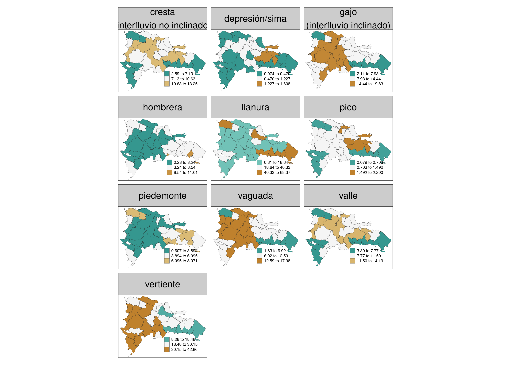

2.  **Creación de los 10 conjuntos** (reserva el conjunto 1 al Tali). Se
    han creado diez conjuntos de seis provincias elegidas al azar
    utilizando sus nombres.

``` r
set.seed(123)
replicas <- replicate(10, sample(prov$nombre, 6))
df <- data.frame(Conjunto = 1:10, t(replicas))
df %>%
  unite("Provincias asignadas", X1:X6, sep = ", ") %>% 
  knitr::kable()
```

| Conjunto | Provincias asignadas                                                                             |
|---------:|:-------------------------------------------------------------------------------------------------|
|        1 | SAN JOSÉ DE OCOA, MONTE CRISTI, HERMANAS MIRABAL, MARÍA TRINIDAD SÁNCHEZ, BAORUCO, INDEPENDENCIA |
|        2 | PUERTO PLATA, SAN JUAN, LA ALTAGRACIA, DAJABÓN, SAMANÁ, MARÍA TRINIDAD SÁNCHEZ                   |
|        3 | SAN JUAN, SANTIAGO, SANTIAGO RODRÍGUEZ, VALVERDE, DAJABÓN, HERMANAS MIRABAL                      |
|        4 | VALVERDE, SANTIAGO, MONSEÑOR NOUEL, SAN JOSÉ DE OCOA, ESPAILLAT, BAORUCO                         |
|        5 | EL SEIBO, SANTIAGO RODRÍGUEZ, ELÍAS PIÑA, INDEPENDENCIA, ESPAILLAT, HERMANAS MIRABAL             |
|        6 | BARAHONA, MARÍA TRINIDAD SÁNCHEZ, PERAVIA, LA ALTAGRACIA, ELÍAS PIÑA, SAN CRISTÓBAL              |
|        7 | LA ROMANA, MONTE CRISTI, INDEPENDENCIA, LA VEGA, ELÍAS PIÑA, ESPAILLAT                           |
|        8 | ESPAILLAT, INDEPENDENCIA, SAN PEDRO DE MACORÍS, VALVERDE, MONSEÑOR NOUEL, SAN CRISTÓBAL          |
|        9 | ELÍAS PIÑA, SAN CRISTÓBAL, VALVERDE, DUARTE, SANTIAGO, AZUA                                      |
|       10 | MONTE PLATA, DAJABÓN, EL SEIBO, LA ROMANA, LA VEGA, PUERTO PLATA                                 |

3.  **Presentación de los datos crudos de cada uno de los diez
    conjuntos**. Esta matriz contiene el porcentaje de la superifice
    provincial ocupada por cada forma del terreno. Con esta matriz
    podrás hacer un cálculo de distancia (parte 1 del mandato, que verás
    en la siguiente sección).

``` r
conjuntos_l <- sapply(1:ncol(replicas),
       function(x)
         prov %>%
         select(-base) %>% 
         filter(nombre %in% replicas[, x]) %>% st_drop_geometry(),
       simplify = F) %>%
  setNames(paste0('Conjunto ', 1:10))
conjuntos_l_k <- lapply(
  conjuntos_l,
  function(x) {
    colnames(x) <- gsub('\\n', '', colnames(x))
    knitr::kable(x, digits = 2, align = 'c')
    })
```

``` r
# Imprimir tablas
for (tabla in 1:length(conjuntos_l_k)) {
  cat('Conjunto', tabla, "\n\n")
  print(conjuntos_l_k[[tabla]])
  cat("\n\n")
}
```

Conjunto 1

|         nombre         | llanura | depresión/sima | pico | cresta(interfluvio no inclinado) | hombrera | gajo(interfluvio inclinado) | vertiente | vaguada | piedemonte | valle |
|:----------------------:|:-------:|:--------------:|:----:|:--------------------------------:|:--------:|:---------------------------:|:---------:|:-------:|:----------:|:-----:|
|        BAORUCO         |  28.09  |      0.18      | 0.61 |               6.66               |   1.54   |            12.39            |   29.65   |  10.87  |    2.60    | 7.41  |
|     INDEPENDENCIA      |  20.53  |      0.26      | 0.63 |               6.41               |   1.46   |            13.12            |   37.19   |  10.55  |    3.16    | 6.69  |
| MARÍA TRINIDAD SÁNCHEZ |  32.33  |      0.45      | 0.83 |               7.86               |   4.40   |            9.28             |   23.75   |  7.90   |    5.06    | 8.12  |
|      MONTE CRISTI      |  43.73  |      0.07      | 0.54 |               5.62               |   4.67   |            7.16             |   20.45   |  6.02   |    6.81    | 4.93  |
|    HERMANAS MIRABAL    |  21.30  |      0.78      | 1.36 |               9.58               |   4.72   |            11.48            |   24.53   |  10.84  |    4.28    | 11.12 |
|    SAN JOSÉ DE OCOA    |  1.26   |      0.61      | 1.09 |              12.12               |   0.23   |            19.83            |   32.97   |  17.98  |    0.61    | 13.31 |

Conjunto 2

|         nombre         | llanura | depresión/sima | pico | cresta(interfluvio no inclinado) | hombrera | gajo(interfluvio inclinado) | vertiente | vaguada | piedemonte | valle |
|:----------------------:|:-------:|:--------------:|:----:|:--------------------------------:|:--------:|:---------------------------:|:---------:|:-------:|:----------:|:-----:|
|        DAJABÓN         |  12.17  |      0.39      | 1.02 |               9.63               |   3.83   |            14.02            |   30.65   |  12.87  |    4.98    | 10.44 |
|     LA ALTAGRACIA      |  55.35  |      0.16      | 0.39 |               3.99               |   5.75   |            4.91             |   14.90   |  4.23   |    5.78    | 4.53  |
| MARÍA TRINIDAD SÁNCHEZ |  32.33  |      0.45      | 0.83 |               7.86               |   4.40   |            9.28             |   23.75   |  7.90   |    5.06    | 8.12  |
|      PUERTO PLATA      |  9.65   |      0.39      | 1.29 |              10.45               |   1.42   |            14.86            |   34.59   |  13.40  |    3.30    | 10.65 |
|         SAMANÁ         |  15.63  |      1.61      | 2.20 |              11.57               |   1.83   |            13.60            |   27.97   |  11.74  |    2.76    | 11.09 |
|        SAN JUAN        |  8.78   |      0.28      | 0.81 |               9.04               |   2.16   |            16.24            |   35.09   |  14.39  |    3.51    | 9.71  |

Conjunto 3

|       nombre       | llanura | depresión/sima | pico | cresta(interfluvio no inclinado) | hombrera | gajo(interfluvio inclinado) | vertiente | vaguada | piedemonte | valle |
|:------------------:|:-------:|:--------------:|:----:|:--------------------------------:|:--------:|:---------------------------:|:---------:|:-------:|:----------:|:-----:|
|      DAJABÓN       |  12.17  |      0.39      | 1.02 |               9.63               |   3.83   |            14.02            |   30.65   |  12.87  |    4.98    | 10.44 |
|  HERMANAS MIRABAL  |  21.30  |      0.78      | 1.36 |               9.58               |   4.72   |            11.48            |   24.53   |  10.84  |    4.28    | 11.12 |
|      SAN JUAN      |  8.78   |      0.28      | 0.81 |               9.04               |   2.16   |            16.24            |   35.09   |  14.39  |    3.51    | 9.71  |
|      SANTIAGO      |  5.82   |      0.60      | 1.14 |              11.25               |   1.60   |            17.25            |   32.15   |  15.95  |    2.08    | 12.18 |
| SANTIAGO RODRÍGUEZ |  1.99   |      0.76      | 1.33 |              13.25               |   2.62   |            16.71            |   31.13   |  15.37  |    2.66    | 14.19 |
|      VALVERDE      |  27.87  |      0.16      | 0.57 |               6.40               |   5.58   |            9.62             |   27.76   |  8.16   |    7.62    | 6.25  |

Conjunto 4

|      nombre      | llanura | depresión/sima | pico | cresta(interfluvio no inclinado) | hombrera | gajo(interfluvio inclinado) | vertiente | vaguada | piedemonte | valle |
|:----------------:|:-------:|:--------------:|:----:|:--------------------------------:|:--------:|:---------------------------:|:---------:|:-------:|:----------:|:-----:|
|     BAORUCO      |  28.09  |      0.18      | 0.61 |               6.66               |   1.54   |            12.39            |   29.65   |  10.87  |    2.60    | 7.41  |
|    ESPAILLAT     |  11.24  |      0.98      | 1.70 |              12.00               |   3.68   |            13.89            |   27.07   |  12.86  |    3.23    | 13.35 |
|     SANTIAGO     |  5.82   |      0.60      | 1.14 |              11.25               |   1.60   |            17.25            |   32.15   |  15.95  |    2.08    | 12.18 |
|     VALVERDE     |  27.87  |      0.16      | 0.57 |               6.40               |   5.58   |            9.62             |   27.76   |  8.16   |    7.62    | 6.25  |
|  MONSEÑOR NOUEL  |  10.32  |      0.40      | 0.82 |              10.14               |   1.45   |            17.09            |   31.41   |  15.01  |    2.82    | 10.52 |
| SAN JOSÉ DE OCOA |  1.26   |      0.61      | 1.09 |              12.12               |   0.23   |            19.83            |   32.97   |  17.98  |    0.61    | 13.31 |

Conjunto 5

|       nombre       | llanura | depresión/sima | pico | cresta(interfluvio no inclinado) | hombrera | gajo(interfluvio inclinado) | vertiente | vaguada | piedemonte | valle |
|:------------------:|:-------:|:--------------:|:----:|:--------------------------------:|:--------:|:---------------------------:|:---------:|:-------:|:----------:|:-----:|
|     ELÍAS PIÑA     |  0.81   |      0.56      | 1.12 |              11.71               |   1.11   |            17.89            |   36.06   |  16.26  |    1.77    | 12.71 |
|      EL SEIBO      |  14.57  |      0.32      | 1.15 |               9.90               |   5.24   |            12.03            |   28.32   |  10.88  |    7.10    | 10.48 |
|     ESPAILLAT      |  11.24  |      0.98      | 1.70 |              12.00               |   3.68   |            13.89            |   27.07   |  12.86  |    3.23    | 13.35 |
|   INDEPENDENCIA    |  20.53  |      0.26      | 0.63 |               6.41               |   1.46   |            13.12            |   37.19   |  10.55  |    3.16    | 6.69  |
|  HERMANAS MIRABAL  |  21.30  |      0.78      | 1.36 |               9.58               |   4.72   |            11.48            |   24.53   |  10.84  |    4.28    | 11.12 |
| SANTIAGO RODRÍGUEZ |  1.99   |      0.76      | 1.33 |              13.25               |   2.62   |            16.71            |   31.13   |  15.37  |    2.66    | 14.19 |

Conjunto 6

|         nombre         | llanura | depresión/sima | pico | cresta(interfluvio no inclinado) | hombrera | gajo(interfluvio inclinado) | vertiente | vaguada | piedemonte | valle |
|:----------------------:|:-------:|:--------------:|:----:|:--------------------------------:|:--------:|:---------------------------:|:---------:|:-------:|:----------:|:-----:|
|        BARAHONA        |  11.83  |      0.27      | 0.78 |               8.48               |   1.15   |            16.47            |   36.09   |  13.39  |    2.02    | 9.52  |
|       ELÍAS PIÑA       |  0.81   |      0.56      | 1.12 |              11.71               |   1.11   |            17.89            |   36.06   |  16.26  |    1.77    | 12.71 |
|     LA ALTAGRACIA      |  55.35  |      0.16      | 0.39 |               3.99               |   5.75   |            4.91             |   14.90   |  4.23   |    5.78    | 4.53  |
| MARÍA TRINIDAD SÁNCHEZ |  32.33  |      0.45      | 0.83 |               7.86               |   4.40   |            9.28             |   23.75   |  7.90   |    5.06    | 8.12  |
|        PERAVIA         |  16.39  |      0.26      | 1.03 |               9.36               |   3.61   |            13.79            |   28.75   |  12.33  |    4.89    | 9.59  |
|     SAN CRISTÓBAL      |  5.57   |      0.60      | 1.15 |              12.12               |   1.90   |            16.60            |   31.10   |  15.15  |    3.14    | 12.68 |

Conjunto 7

|    nombre     | llanura | depresión/sima | pico | cresta(interfluvio no inclinado) | hombrera | gajo(interfluvio inclinado) | vertiente | vaguada | piedemonte | valle |
|:-------------:|:-------:|:--------------:|:----:|:--------------------------------:|:--------:|:---------------------------:|:---------:|:-------:|:----------:|:-----:|
|  ELÍAS PIÑA   |  0.81   |      0.56      | 1.12 |              11.71               |   1.11   |            17.89            |   36.06   |  16.26  |    1.77    | 12.71 |
|   ESPAILLAT   |  11.24  |      0.98      | 1.70 |              12.00               |   3.68   |            13.89            |   27.07   |  12.86  |    3.23    | 13.35 |
| INDEPENDENCIA |  20.53  |      0.26      | 0.63 |               6.41               |   1.46   |            13.12            |   37.19   |  10.55  |    3.16    | 6.69  |
|   LA ROMANA   |  57.78  |      0.29      | 0.11 |               3.23               |   9.67   |            2.92             |   11.74   |  2.70   |    7.20    | 4.37  |
|    LA VEGA    |  14.44  |      0.49      | 1.03 |              10.82               |   1.07   |            16.03            |   28.01   |  14.83  |    1.41    | 11.87 |
| MONTE CRISTI  |  43.73  |      0.07      | 0.54 |               5.62               |   4.67   |            7.16             |   20.45   |  6.02   |    6.81    | 4.93  |

Conjunto 8

|        nombre        | llanura | depresión/sima | pico | cresta(interfluvio no inclinado) | hombrera | gajo(interfluvio inclinado) | vertiente | vaguada | piedemonte | valle |
|:--------------------:|:-------:|:--------------:|:----:|:--------------------------------:|:--------:|:---------------------------:|:---------:|:-------:|:----------:|:-----:|
|      ESPAILLAT       |  11.24  |      0.98      | 1.70 |              12.00               |   3.68   |            13.89            |   27.07   |  12.86  |    3.23    | 13.35 |
|    INDEPENDENCIA     |  20.53  |      0.26      | 0.63 |               6.41               |   1.46   |            13.12            |   37.19   |  10.55  |    3.16    | 6.69  |
|    SAN CRISTÓBAL     |  5.57   |      0.60      | 1.15 |              12.12               |   1.90   |            16.60            |   31.10   |  15.15  |    3.14    | 12.68 |
| SAN PEDRO DE MACORÍS |  68.37  |      0.14      | 0.08 |               2.59               |   7.42   |            2.11             |   8.28    |  1.83   |    5.87    | 3.30  |
|       VALVERDE       |  27.87  |      0.16      | 0.57 |               6.40               |   5.58   |            9.62             |   27.76   |  8.16   |    7.62    | 6.25  |
|    MONSEÑOR NOUEL    |  10.32  |      0.40      | 0.82 |              10.14               |   1.45   |            17.09            |   31.41   |  15.01  |    2.82    | 10.52 |

Conjunto 9

|    nombre     | llanura | depresión/sima | pico | cresta(interfluvio no inclinado) | hombrera | gajo(interfluvio inclinado) | vertiente | vaguada | piedemonte | valle |
|:-------------:|:-------:|:--------------:|:----:|:--------------------------------:|:--------:|:---------------------------:|:---------:|:-------:|:----------:|:-----:|
|     AZUA      |  8.54   |      0.28      | 0.98 |               9.75               |   1.55   |            16.64            |   34.34   |  14.79  |    2.73    | 10.41 |
|    DUARTE     |  43.61  |      0.80      | 1.20 |               7.60               |   2.49   |            8.69             |   16.51   |  7.83   |    2.90    | 8.38  |
|  ELÍAS PIÑA   |  0.81   |      0.56      | 1.12 |              11.71               |   1.11   |            17.89            |   36.06   |  16.26  |    1.77    | 12.71 |
| SAN CRISTÓBAL |  5.57   |      0.60      | 1.15 |              12.12               |   1.90   |            16.60            |   31.10   |  15.15  |    3.14    | 12.68 |
|   SANTIAGO    |  5.82   |      0.60      | 1.14 |              11.25               |   1.60   |            17.25            |   32.15   |  15.95  |    2.08    | 12.18 |
|   VALVERDE    |  27.87  |      0.16      | 0.57 |               6.40               |   5.58   |            9.62             |   27.76   |  8.16   |    7.62    | 6.25  |

Conjunto 10

|    nombre    | llanura | depresión/sima | pico | cresta(interfluvio no inclinado) | hombrera | gajo(interfluvio inclinado) | vertiente | vaguada | piedemonte | valle |
|:------------:|:-------:|:--------------:|:----:|:--------------------------------:|:--------:|:---------------------------:|:---------:|:-------:|:----------:|:-----:|
|   DAJABÓN    |  12.17  |      0.39      | 1.02 |               9.63               |   3.83   |            14.02            |   30.65   |  12.87  |    4.98    | 10.44 |
|   EL SEIBO   |  14.57  |      0.32      | 1.15 |               9.90               |   5.24   |            12.03            |   28.32   |  10.88  |    7.10    | 10.48 |
|  LA ROMANA   |  57.78  |      0.29      | 0.11 |               3.23               |   9.67   |            2.92             |   11.74   |  2.70   |    7.20    | 4.37  |
|   LA VEGA    |  14.44  |      0.49      | 1.03 |              10.82               |   1.07   |            16.03            |   28.01   |  14.83  |    1.41    | 11.87 |
| PUERTO PLATA |  9.65   |      0.39      | 1.29 |              10.45               |   1.42   |            14.86            |   34.59   |  13.40  |    3.30    | 10.65 |
| MONTE PLATA  |  16.44  |      1.51      | 1.76 |              11.38               |   6.24   |            11.15            |   23.44   |  9.95   |    5.52    | 12.61 |

4.  **Generación de la matriz de distancias de cada uno de los diez
    conjuntos**. Esta es la matriz de distancias con la que podrás
    realizar el agrupamiento jerárquico UPGMA (parte 2 del mandato, que
    verás en la siguiente sección).

``` r
# Mostrar las matrices de distancia
print(sapply(
  conjuntos_l,
  function(x) {
    x %>%
      as.data.frame() %>%
      column_to_rownames('nombre') %>%
      dist(diag = T, upper = T) %>% 
      as.matrix() %>% 
      as.data.frame() %>% 
      knitr::kable(digits = 2, align = 'c')
  },
  simplify = F))
```

\$`Conjunto 1`

|                        | BAORUCO | INDEPENDENCIA | MARÍA TRINIDAD SÁNCHEZ | MONTE CRISTI | HERMANAS MIRABAL | SAN JOSÉ DE OCOA |
|:-----------------------|:-------:|:-------------:|:----------------------:|:------------:|:----------------:|:----------------:|
| BAORUCO                |  0.00   |     10.75     |          9.36          |    20.37     |      10.46       |      30.12       |
| INDEPENDENCIA          |  10.75  |     0.00      |         18.93          |    30.03     |      14.36       |      23.96       |
| MARÍA TRINIDAD SÁNCHEZ |  9.36   |     18.93     |          0.00          |    12.94     |      12.20       |      36.68       |
| MONTE CRISTI           |  20.37  |     30.03     |         12.94          |     0.00     |      24.96       |      49.34       |
| HERMANAS MIRABAL       |  10.46  |     14.36     |         12.20          |    24.96     |       0.00       |      25.27       |
| SAN JOSÉ DE OCOA       |  30.12  |     23.96     |         36.68          |    49.34     |      25.27       |       0.00       |

\$`Conjunto 2`

|                        | DAJABÓN | LA ALTAGRACIA | MARÍA TRINIDAD SÁNCHEZ | PUERTO PLATA | SAMANÁ | SAN JUAN |
|:-----------------------|:-------:|:-------------:|:----------------------:|:------------:|:------:|:--------:|
| DAJABÓN                |  0.00   |     48.39     |         22.58          |     5.68     |  6.06  |   6.66   |
| LA ALTAGRACIA          |  48.39  |     0.00      |         25.91          |    52.58     | 44.84  |  53.65   |
| MARÍA TRINIDAD SÁNCHEZ |  22.58  |     25.91     |          0.00          |    26.80     | 19.18  |  28.02   |
| PUERTO PLATA           |  5.68   |     52.58     |         26.80          |     0.00     |  9.39  |   2.75   |
| SAMANÁ                 |  6.06   |     44.84     |         19.18          |     9.39     |  0.00  |  11.15   |
| SAN JUAN               |  6.66   |     53.65     |         28.02          |     2.75     | 11.15  |   0.00   |

\$`Conjunto 3`

|                    | DAJABÓN | HERMANAS MIRABAL | SAN JUAN | SANTIAGO | SANTIAGO RODRÍGUEZ | VALVERDE |
|:-------------------|:-------:|:----------------:|:--------:|:--------:|:------------------:|:--------:|
| DAJABÓN            |  0.00   |      11.55       |   6.66   |   9.04   |       12.32        |  18.29   |
| HERMANAS MIRABAL   |  11.55  |       0.00       |  17.71   |  19.39   |       22.23        |  10.54   |
| SAN JUAN           |  6.66   |      17.71       |   0.00   |   5.87   |       10.11        |  23.42   |
| SANTIAGO           |  9.04   |      19.39       |   5.87   |   0.00   |        5.08        |  27.03   |
| SANTIAGO RODRÍGUEZ |  12.32  |      22.23       |  10.11   |   5.08   |        0.00        |  30.46   |
| VALVERDE           |  18.29  |      10.54       |  23.42   |  27.03   |       30.46        |   0.00   |

\$`Conjunto 4`

|                  | BAORUCO | ESPAILLAT | SANTIAGO | VALVERDE | MONSEÑOR NOUEL | SAN JOSÉ DE OCOA |
|:-----------------|:-------:|:---------:|:--------:|:--------:|:--------------:|:----------------:|
| BAORUCO          |  0.00   |   19.16   |  24.42   |   7.84   |     19.49      |      30.12       |
| ESPAILLAT        |  19.16  |   0.00    |   9.17   |  20.59   |      7.23      |      14.67       |
| SANTIAGO         |  24.42  |   9.17    |   0.00   |  27.03   |      5.14      |       6.19       |
| VALVERDE         |  7.84   |   20.59   |  27.03   |   0.00   |     22.28      |      33.12       |
| MONSEÑOR NOUEL   |  19.49  |   7.23    |   5.14   |  22.28   |      0.00      |      10.91       |
| SAN JOSÉ DE OCOA |  30.12  |   14.67   |   6.19   |  33.12   |     10.91      |       0.00       |

\$`Conjunto 5`

|                    | ELÍAS PIÑA | EL SEIBO | ESPAILLAT | INDEPENDENCIA | HERMANAS MIRABAL | SANTIAGO RODRÍGUEZ |
|:-------------------|:----------:|:--------:|:---------:|:-------------:|:----------------:|:------------------:|
| ELÍAS PIÑA         |    0.00    |  19.15   |   15.07   |     22.63     |      25.50       |        5.97        |
| EL SEIBO           |   19.15    |   0.00   |   7.13    |     13.12     |       8.31       |       16.13        |
| ESPAILLAT          |   15.07    |   7.13   |   0.00    |     16.63     |      11.43       |       10.97        |
| INDEPENDENCIA      |   22.63    |  13.12   |   16.63   |     0.00      |      14.36       |       22.84        |
| HERMANAS MIRABAL   |   25.50    |   8.31   |   11.43   |     14.36     |       0.00       |       22.23        |
| SANTIAGO RODRÍGUEZ |    5.97    |  16.13   |   10.97   |     22.84     |      22.23       |        0.00        |

\$`Conjunto 6`

|                        | BARAHONA | ELÍAS PIÑA | LA ALTAGRACIA | MARÍA TRINIDAD SÁNCHEZ | PERAVIA | SAN CRISTÓBAL |
|:-----------------------|:--------:|:----------:|:-------------:|:----------------------:|:-------:|:-------------:|
| BARAHONA               |   0.00   |   12.36    |     51.39     |         26.01          |  9.91   |     9.62      |
| ELÍAS PIÑA             |  12.36   |    0.00    |     62.46     |         36.70          |  18.97  |     7.27      |
| LA ALTAGRACIA          |  51.39   |   62.46    |     0.00      |         25.91          |  43.76  |     56.14     |
| MARÍA TRINIDAD SÁNCHEZ |  26.01   |   36.70    |     25.91     |          0.00          |  18.01  |     30.42     |
| PERAVIA                |   9.91   |   18.97    |     43.76     |         18.01          |  0.00   |     12.72     |
| SAN CRISTÓBAL          |   9.62   |    7.27    |     56.14     |         30.42          |  12.72  |     0.00      |

\$`Conjunto 7`

|               | ELÍAS PIÑA | ESPAILLAT | INDEPENDENCIA | LA ROMANA | LA VEGA | MONTE CRISTI |
|:--------------|:----------:|:---------:|:-------------:|:---------:|:-------:|:------------:|
| ELÍAS PIÑA    |    0.00    |   15.07   |     22.63     |   67.02   |  16.06  |    49.42     |
| ESPAILLAT     |   15.07    |   0.00    |     16.63     |   53.26   |  5.82   |    36.31     |
| INDEPENDENCIA |   22.63    |   16.63   |     0.00      |   47.97   |  14.06  |    30.03     |
| LA ROMANA     |   67.02    |   53.26   |     47.97     |   0.00    |  51.81  |    18.27     |
| LA VEGA       |   16.06    |   5.82    |     14.06     |   51.81   |  0.00   |    34.48     |
| MONTE CRISTI  |   49.42    |   36.31   |     30.03     |   18.27   |  34.48  |     0.00     |

\$`Conjunto 8`

|                      | ESPAILLAT | INDEPENDENCIA | SAN CRISTÓBAL | SAN PEDRO DE MACORÍS | VALVERDE | MONSEÑOR NOUEL |
|:---------------------|:---------:|:-------------:|:-------------:|:--------------------:|:--------:|:--------------:|
| ESPAILLAT            |   0.00    |     16.63     |     8.07      |        63.96         |  20.59   |      7.23      |
| INDEPENDENCIA        |   16.63   |     0.00      |     19.06     |        58.23         |  14.07   |     14.21      |
| SAN CRISTÓBAL        |   8.07    |     19.06     |     0.00      |        71.20         |  26.73   |      5.66      |
| SAN PEDRO DE MACORÍS |   63.96   |     58.23     |     71.20     |         0.00         |  46.32   |     66.76      |
| VALVERDE             |   20.59   |     14.07     |     26.73     |        46.32         |   0.00   |     22.28      |
| MONSEÑOR NOUEL       |   7.23    |     14.21     |     5.66      |        66.76         |  22.28   |      0.00      |

\$`Conjunto 9`

|               | AZUA  | DUARTE | ELÍAS PIÑA | SAN CRISTÓBAL | SANTIAGO | VALVERDE |
|:--------------|:-----:|:------:|:----------:|:-------------:|:--------:|:--------:|
| AZUA          | 0.00  | 40.86  |    8.77    |     5.54      |   4.46   |  24.06   |
| DUARTE        | 40.86 |  0.00  |   49.09    |     42.61     |  42.92   |  20.35   |
| ELÍAS PIÑA    | 8.77  | 49.09  |    0.00    |     7.27      |   6.46   |  32.56   |
| SAN CRISTÓBAL | 5.54  | 42.61  |    7.27    |     0.00      |   2.11   |  26.73   |
| SANTIAGO      | 4.46  | 42.92  |    6.46    |     2.11      |   0.00   |  27.03   |
| VALVERDE      | 24.06 | 20.35  |   32.56    |     26.73     |  27.03   |   0.00   |

\$`Conjunto 10`

|              | DAJABÓN | EL SEIBO | LA ROMANA | LA VEGA | PUERTO PLATA | MONTE PLATA |
|:-------------|:-------:|:--------:|:---------:|:-------:|:------------:|:-----------:|
| DAJABÓN      |  0.00   |   5.07   |   52.74   |  6.62   |     5.68     |    10.13    |
| EL SEIBO     |  5.07   |   0.00   |   48.93   |  9.19   |    10.36     |    6.41     |
| LA ROMANA    |  52.74  |  48.93   |   0.00    |  51.81  |    57.20     |    46.04    |
| LA VEGA      |  6.62   |   9.19   |   51.81   |  0.00   |     8.65     |    10.89    |
| PUERTO PLATA |  5.68   |  10.36   |   57.20   |  8.65   |     0.00     |    15.18    |
| MONTE PLATA  |  10.13  |   6.41   |   46.04   |  10.89  |    15.18     |    0.00     |

## **Mandato**.

> Ten presente un aspecto importante. El Tali te provee la matriz de
> distancias para que realices el agrupamiento (parte 2 de este
> mandato). Sin embargo, el Tali también te pide, en la parte 1 de este
> mandato que, a modo de prueba, calcules la distancia euclidiana para
> dos pares de provincias elegidos al azar de entre los 15 posibles.
> Esto tiene por objetivo que puedas medir tu rendimiento en el cálculo
> de distancias en un espacio n-dimensional.

1.  Usando los datos generados por Martínez-Batlle (2022), para el
    conjunto que te tocó (recuerda reservar el conjunto 1 al Tali),
    obtén la distancia euclidiana entre un par de provincias elegidas
    por ti al azar (tienes que analizar 6 provincias, elige un par al
    azar). Haz este cálculo usando todas las dimensiones (atributos)
    disponibles (diez en total). Ten presente que, para incluir las diez
    dimensiones, deberás usar la fórmula generalizada de la distancia
    que verás en el ejemplo práctico, la cual considera un espacio
    n-dimensional (es decir, sumando los cuadrados de las diferencias
    entre sus coordenadas correspondientes en cada una de las diez
    dimensiones, y tomando la raíz cuadrada del resultado). Esta parte
    del ejercicio tiene triple propósito: a) Verificar tu rendimiento
    para calcular distancias en un espacio n-dimensional, donde n\>3; b)
    Comprobar la precisión del algoritmo distancias; c) Medir tu
    rendimiento calculando distancias en un n-dimensional. Es
    recomendable que, para los cálculos, redondees a dos cifras
    significativas. Verifica que tu cálculo da próximo al generado en la
    matriz de distancias.

2.  Aplica el método de agrupamiento jerárquico aglomerativo promedio no
    ponderado (UPGMA) para agrupar las provincias según sus formas
    predominantes, usando la matriz de distancias provista arriba.

3.  Redacta, en un máximo de cuatro párrafos, lo siguiente:

- Introducción, en el que podrías incluir importancia del ejercicio,
  objetivo, justificación.
- Materiales y métodos, donde resumas que materiales usaste (esto
  incluye hasta el teléfono móvil, papel, lápiz, etc.), y las técnicas
  específicas empleadas, que en tu caso son la distancia y el método de
  agrupamiento enseñado.
- Resultado, lo cual supone describir, fríamente, lo que obtuviste.
- Discusión, donde indiques si alcanzaste el objetivo, interpretes el
  resultado, indiques las limitaciones y los posibles trabajos futuros.

# Ejemplo práctico

## Parte 1. Calcular distancia entre dos provincias.

Para calcular la distancia entre dos provincias cualquiera utilizando
las diez dimensiones proporcionadas (las columnas de distribución
porcentual de las formas del terreno), se puede utilizar la **distancia
euclidiana** en un espacio n-dimensional. La fórmula para calcular la
distancia euclidiana entre dos puntos $A$ y $B$ en un espacio de $n$
dimensiones es:

$$
d(A, B) = \sqrt{\sum_{i=1}^{n} (x_{i} - y_{i})^2}
$$

donde: - $d(A, B)$ es la distancia euclidiana entre los puntos $A$ y
$B$. - $x_{i}$ y $y_{i}$ son las coordenadas (en este caso, los
porcentajes de cada forma del terreno) de los puntos $A$ y $B$ en la
dimensión $i$. - $n = 10$, que corresponde al número de dimensiones o
variables consideradas.

- Ejemplo de cálculo:

Vamos a calcular la distancia euclidiana entre las provincias
**BAORUCO** e **INDEPENDENCIA**:

| Proporción de forma del terreno   | BAORUCO ($x_i$) | INDEPENDENCIA ($y_i$) |               $(x_i - y_i)^2$ |
|:----------------------------------|----------------:|----------------------:|------------------------------:|
| Llanura                           |           28.09 |                 20.53 |   $(28.09 - 20.53)^2 = 57.35$ |
| Depresión/sima                    |            0.18 |                  0.26 |    $(0.18 - 0.26)^2 = 0.0064$ |
| Pico                              |            0.61 |                  0.63 |    $(0.61 - 0.63)^2 = 0.0004$ |
| Cresta (interfluvio no inclinado) |            6.66 |                  6.41 |    $(6.66 - 6.41)^2 = 0.0625$ |
| Hombrera                          |            1.54 |                  1.46 |    $(1.54 - 1.46)^2 = 0.0064$ |
| Gajo (interfluvio inclinado)      |           12.39 |                 13.12 |  $(12.39 - 13.12)^2 = 0.5329$ |
| Vertiente                         |           29.65 |                 37.19 | $(29.65 - 37.19)^2 = 56.7121$ |
| Vaguada                           |           10.87 |                 10.55 |  $(10.87 - 10.55)^2 = 0.1024$ |
| Piedemonte                        |            2.60 |                  3.16 |    $(2.60 - 3.16)^2 = 0.3136$ |
| Valle                             |            7.41 |                  6.69 |    $(7.41 - 6.69)^2 = 0.5184$ |

Sumamos todas las diferencias al cuadrado:

$$
\sum_{i=1}^{10} (x_{i} - y_{i})^2 = 57.35 + 0.0064 + 0.0004 + 0.0625 + 0.0064 + 0.5329 + 56.7121 + 0.1024 + 0.3136 + 0.5184 = 115.61
$$

Luego, tomamos la raíz cuadrada de esta suma para obtener la distancia
euclidiana:

$$
d(\text{BAORUCO, INDEPENDENCIA}) = \sqrt{115.61} \approx 10.75
$$

- Resultado

La distancia euclidiana entre las provincias **BAORUCO** e
**INDEPENDENCIA** es aproximadamente **10.75** unidades porcentuales.
Esta distancia representa la magnitud de la diferencia en la
distribución de formas del terreno entre las dos provincias
consideradas.

## Parte 2. Aplicar el método UPGMA

Para realizar un agrupamiento jerárquico utilizando el método de
agrupamiento jerárquico aglomerativo promedio no ponderado (UPGMA),
seguimos un enfoque iterativo que consiste en agrupar los pares de
elementos o clusters más cercanos hasta que todos los elementos estén en
un único cluster. UPGMA utiliza las distancias promedio entre todos los
miembros de los clusters para calcular la distancia entre clusters.
[Este vídeo](https://www.youtube.com/watch?v=RdT7bhm1M3E) también podría
resultarte útil, aunque en el vídeo, la instructora se basa en el
vínculo simple, no en el promedio; es decir, ella, en lugar de obtener
promedios a la hora de recalcular la matriz de distancias, lo que
obtiene son valores mínimos, pero en nuestro casos serían promedios.

### Matriz de Distancias Inicial

Dado el conjunto de datos del Conjunto 1:

|                            | BAORUCO | INDEPENDENCIA | MARÍA TRINIDAD SÁNCHEZ | MONTE CRISTI | HERMANAS MIRABAL | SAN JOSÉ DE OCOA |
|----------------------------|---------|---------------|------------------------|--------------|------------------|------------------|
| **INDEPENDENCIA**          | 10.7    |               |                        |              |                  |                  |
| **MARÍA TRINIDAD SÁNCHEZ** | 9.4     | 18.9          |                        |              |                  |                  |
| **MONTE CRISTI**           | 20.4    | 30.0          | 12.9                   |              |                  |                  |
| **HERMANAS MIRABAL**       | 10.5    | 14.4          | 12.2                   | 25.0         |                  |                  |
| **SAN JOSÉ DE OCOA**       | 30.1    | 24.0          | 36.7                   | 49.3         | 25.3             |                  |

### Paso 1: Encuentra el par con la distancia más pequeña

- El par con la distancia más pequeña es **BAORUCO** y **MARÍA TRINIDAD
  SÁNCHEZ** con una distancia de 9.4. Este par forma el primer grupo.

### Paso 2: Agrupa los elementos más cercanos

- Agrupamos **BAORUCO** y **MARÍA TRINIDAD SÁNCHEZ** en un nuevo cluster
  (B-MTS).

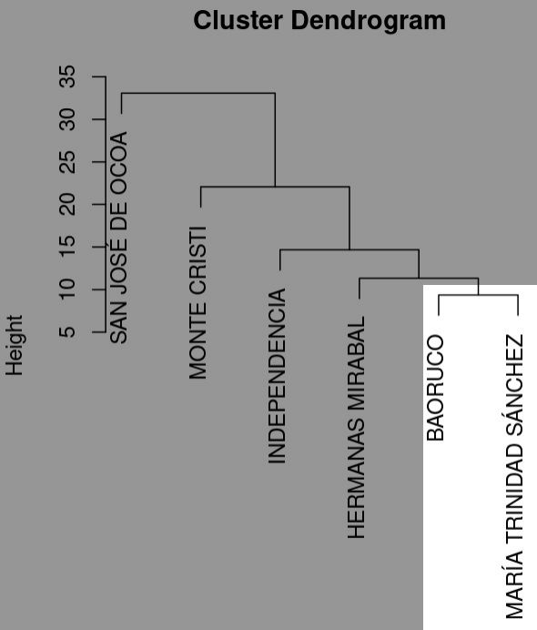

- Calculamos la distancia entre este nuevo cluster (B-MTS) y los otros
  elementos utilizando el promedio de las distancias:

$$
\text{Distancia}(B-MTS, \text{INDEPENDENCIA}) = \frac{10.7 + 18.9}{2} = 14.8
$$

$$
\text{Distancia}(B-MTS, \text{MONTE CRISTI}) = \frac{20.4 + 12.9}{2} = 16.65
$$

$$
\text{Distancia}(B-MTS, \text{HERMANAS MIRABAL}) = \frac{10.5 + 12.2}{2} = 11.35
$$

$$
\text{Distancia}(B-MTS, \text{SAN JOSÉ DE OCOA}) = \frac{30.1 + 36.7}{2} = 33.4
$$

- Nueva matriz de distancias:

|                      | B-MTS | INDEPENDENCIA | MONTE CRISTI | HERMANAS MIRABAL | SAN JOSÉ DE OCOA |
|----------------------|-------|---------------|--------------|------------------|------------------|
| **B-MTS**            |       | 14.8          | 16.65        | 11.35            | 33.4             |
| **INDEPENDENCIA**    | 14.8  |               | 30.0         | 14.4             | 24.0             |
| **MONTE CRISTI**     | 16.65 | 30.0          |              | 25.0             | 49.3             |
| **HERMANAS MIRABAL** | 11.35 | 14.4          | 25.0         |                  | 25.3             |
| **SAN JOSÉ DE OCOA** | 33.4  | 24.0          | 49.3         | 25.3             |                  |

### Paso 3: Encuentra el Siguiente Par con la Distancia más Pequeña

- El par con la distancia más pequeña es **B-MTS** y **HERMANAS
  MIRABAL** con una distancia de 11.35.

### Paso 4: Agrupa el Nuevo Cluster

- Agrupamos **B-MTS** y **HERMANAS MIRABAL** en un nuevo cluster
  (B-MTS-HM).

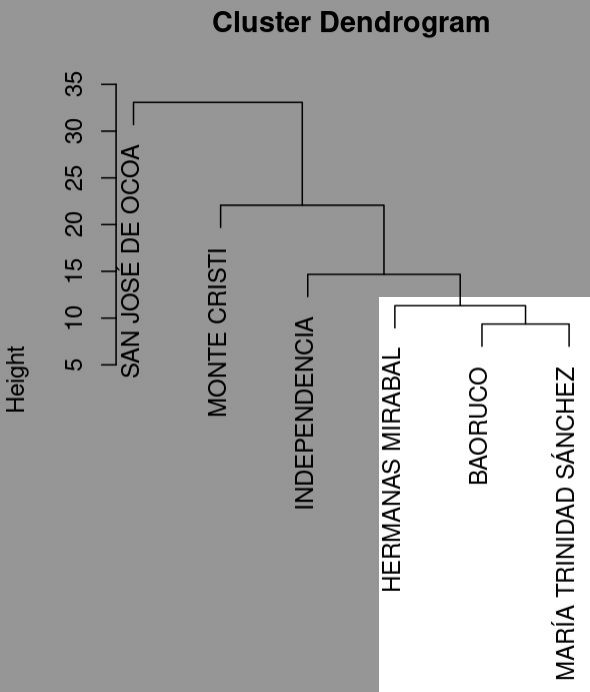

- Calculamos la distancia entre el nuevo cluster (B-MTS-HM) y los otros
  elementos:

$$
\text{Distancia}(B-MTS-HM, \text{INDEPENDENCIA}) = \frac{14.8 + 14.4}{2} = 14.6
$$

$$
\text{Distancia}(B-MTS-HM, \text{MONTE CRISTI}) = \frac{16.65 + 25.0}{2} = 20.825
$$

$$
\text{Distancia}(B-MTS-HM, \text{SAN JOSÉ DE OCOA}) = \frac{33.4 + 25.3}{2} = 29.35
$$

- Nueva matriz de distancias:

|                      | B-MTS-HM | INDEPENDENCIA | MONTE CRISTI | SAN JOSÉ DE OCOA |
|----------------------|----------|---------------|--------------|------------------|
| **B-MTS-HM**         |          | 14.6          | 20.825       | 29.35            |
| **INDEPENDENCIA**    | 14.6     |               | 30.0         | 24.0             |
| **MONTE CRISTI**     | 20.825   | 30.0          |              | 49.3             |
| **SAN JOSÉ DE OCOA** | 29.35    | 24.0          | 49.3         |                  |

### Paso 5: Repite el Proceso Hasta Que Todos los Elementos Sean Agrupados

1.  Agrupa **B-MTS-HM** y **INDEPENDENCIA** (distancia de 14.6).

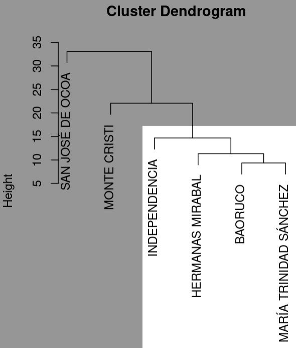

2.  Continúa agrupando siguiendo el mismo proceso iterativo hasta que
    todas las provincias estén en un solo cluster.

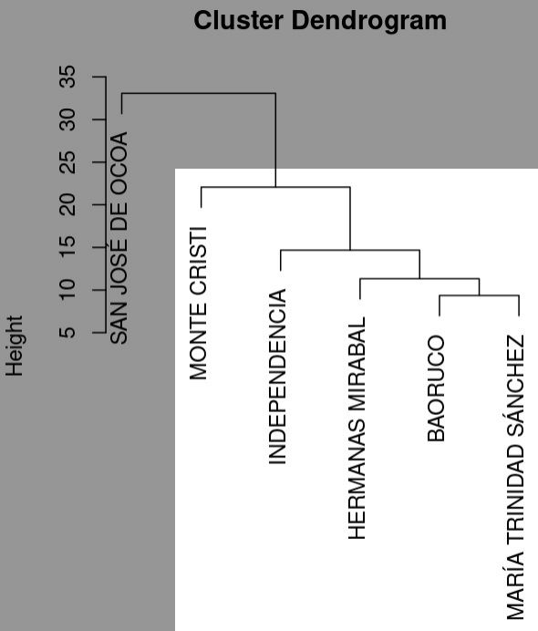

### Dendrograma

El resultado final de este proceso se puede representar mediante un
dendrograma, que muestra la estructura jerárquica de los agrupamientos:

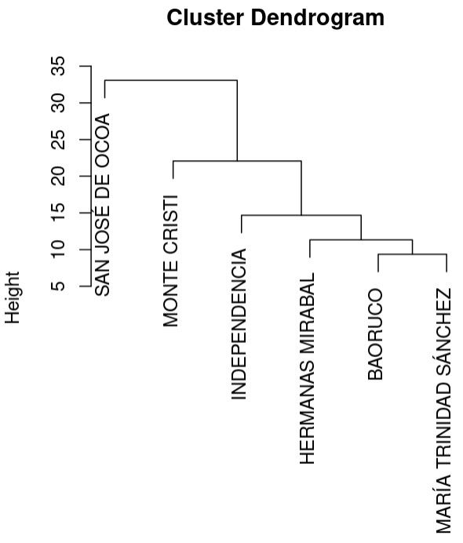

### Conclusión

Este procedimiento de UPGMA nos permite agrupar las provincias en
función de sus similitudes geomorfológicas basadas en la distancia
euclidiana de sus características. Esto ayuda a identificar patrones de
distribución de formas del terreno y a realizar análisis comparativos
entre diferentes unidades territoriales.

# ¿Cómo se haría el ejemplo práctico y cómo se ven todos los árboles en R?

- El ejemplo práctico

``` r
conjuntos_l_1 <- conjuntos_l[[1]]
dist_conj_1 <- conjuntos_l_1 %>%
  as.data.frame() %>%
  column_to_rownames('nombre') %>%
  dist(diag = T, upper = T)
conj_1_upgma <- hclust(dist_conj_1, method = 'average')
plot(conj_1_upgma)
```

- Todos

``` r
invisible(sapply(names(conjuntos_l),
       function(x) {
         d <- conjuntos_l[[x]] %>% 
           as.data.frame() %>%
           column_to_rownames('nombre') %>%
           dist(diag = T, upper = T)
         u <- hclust(d, method = 'average')
         plot(u, main = x)
       }))
```

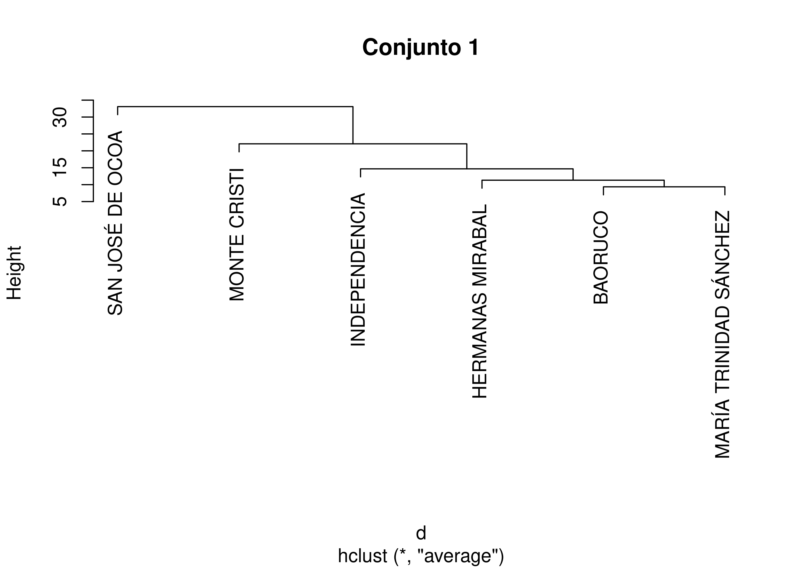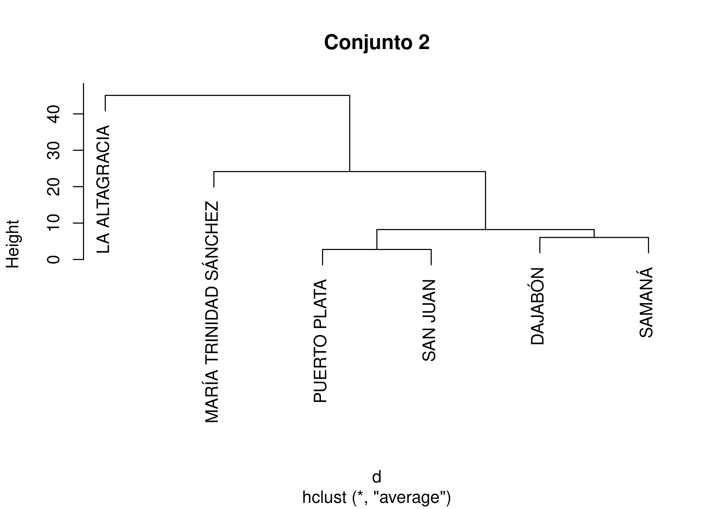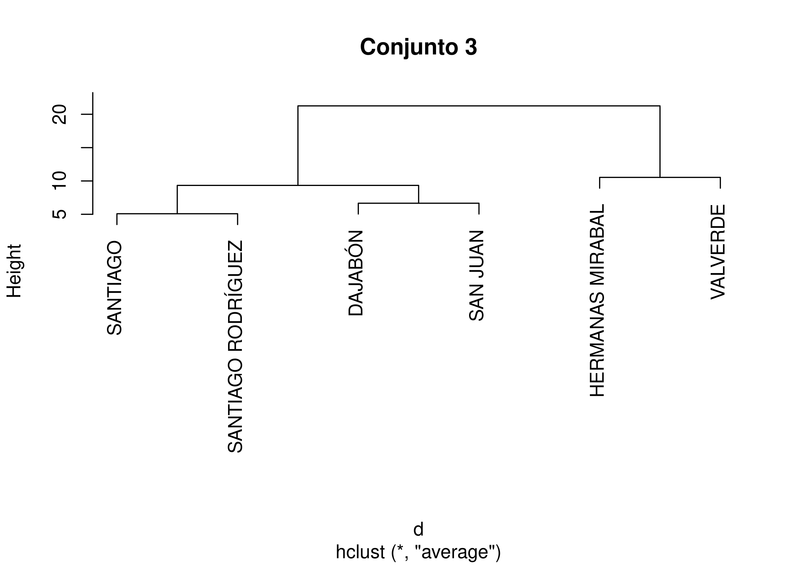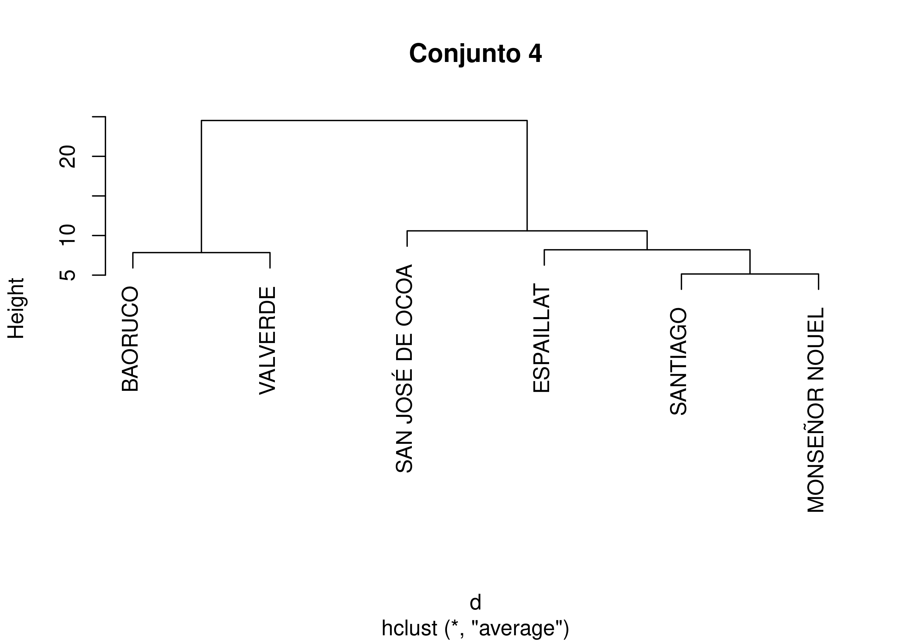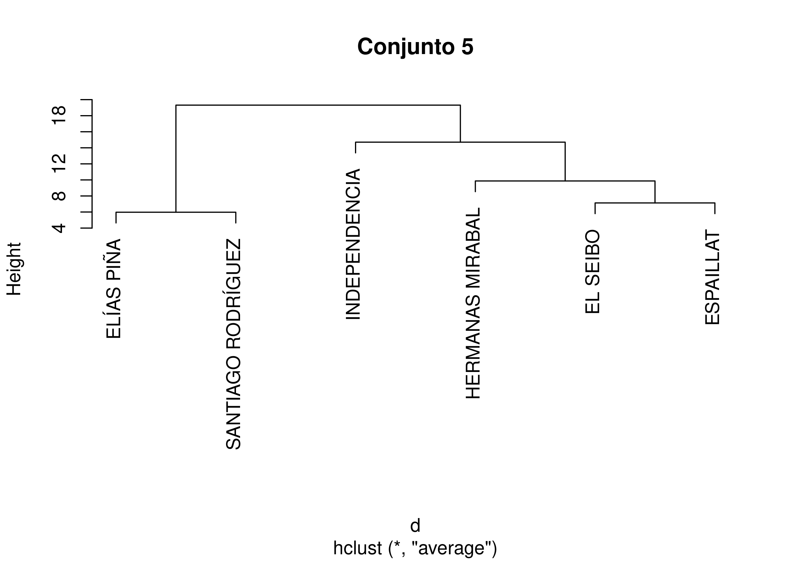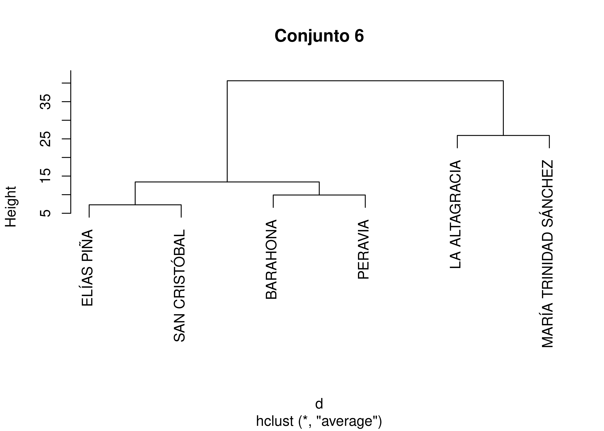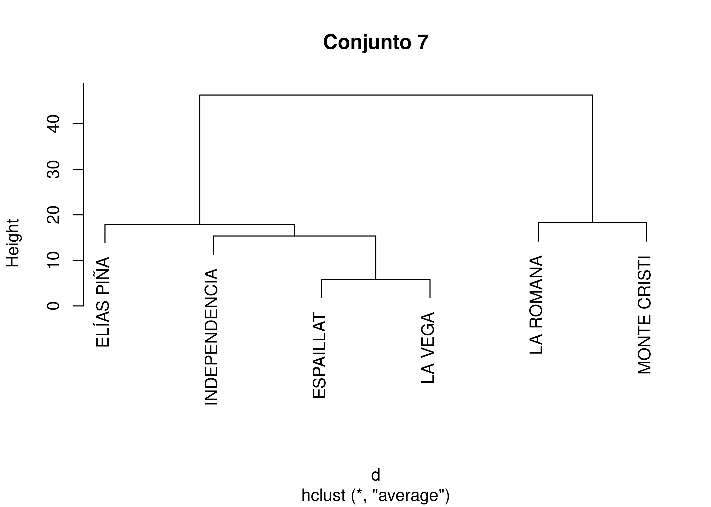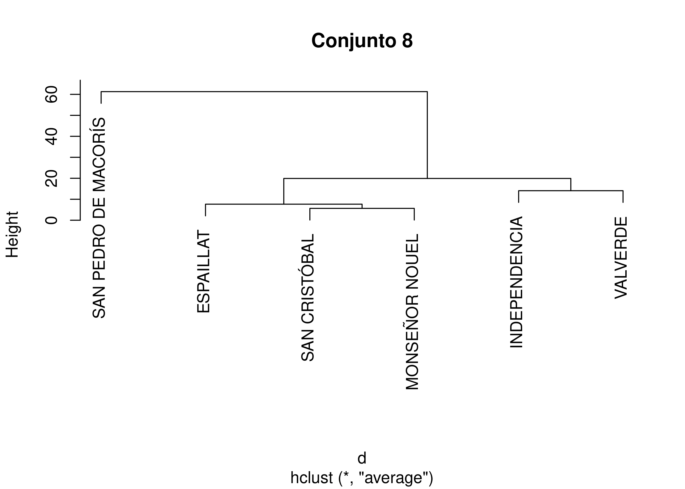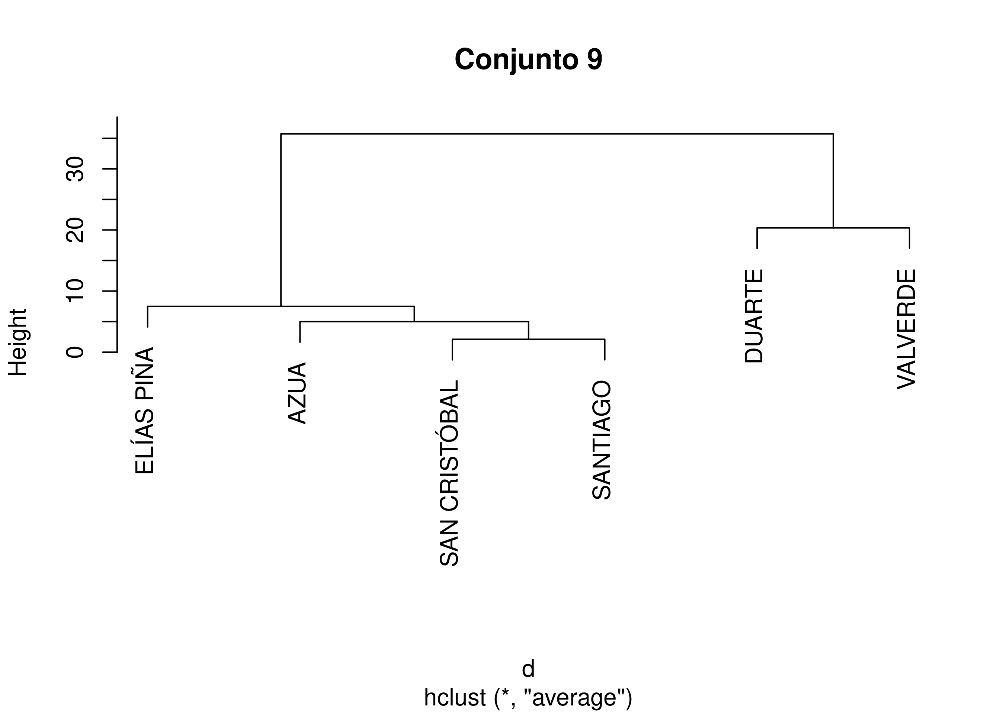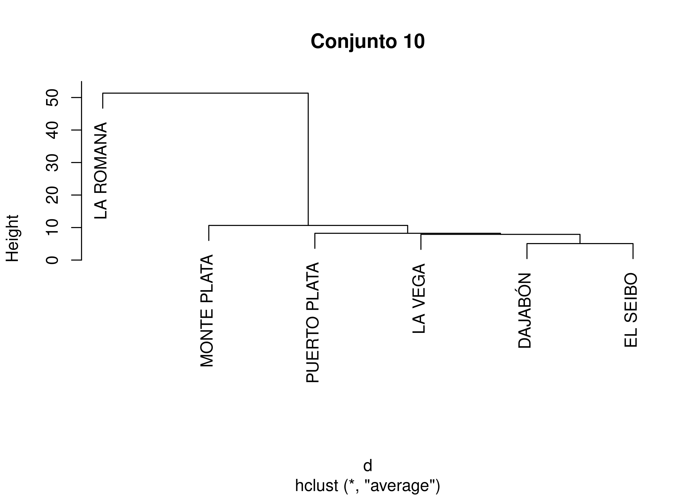

**Nota**: los cálculos se pueden realizar a mano o con una calculadora
del teléfono, utilizando las fórmulas proporcionadas.

## Referencias

<div id="refs" class="references csl-bib-body hanging-indent"
entry-spacing="0">

<div id="ref-borcard_numerical_2018" class="csl-entry">

Borcard, Daniel, François Gillet, and Pierre Legendre. 2018. *Numerical
Ecology with R*. Use R! Cham: Springer International Publishing.
<https://doi.org/10.1007/978-3-319-71404-2>.

</div>

<div id="ref-hengl2008geomorphometry" class="csl-entry">

Hengl, Tomislav, and Hannes I Reuter. 2008. *Geomorphometry: Concepts,
Software, Applications*. Vol. 33. Elsevier.

</div>

<div id="ref-jasiewicz2013geomorphons" class="csl-entry">

Jasiewicz, Jarosław, and Tomasz F Stepinski. 2013. “Geomorphons—a
Pattern Recognition Approach to Classification and Mapping of
Landforms.” *Geomorphology* 182: 147–56.

</div>

<div id="ref-jose_ramon_martinez_batlle_2022_7367180" class="csl-entry">

Martínez-Batlle, José Ramón. 2022.
“<span class="nocase">geofis/zonal-statistics: Let there be
environmental variables</span>.” Zenodo.
<https://doi.org/10.5281/zenodo.7367256>.

</div>

<div id="ref-triola2012estadistica" class="csl-entry">

Triola, M. F. 2012. *Estadistica*. Pearson Education.

</div>

</div>
